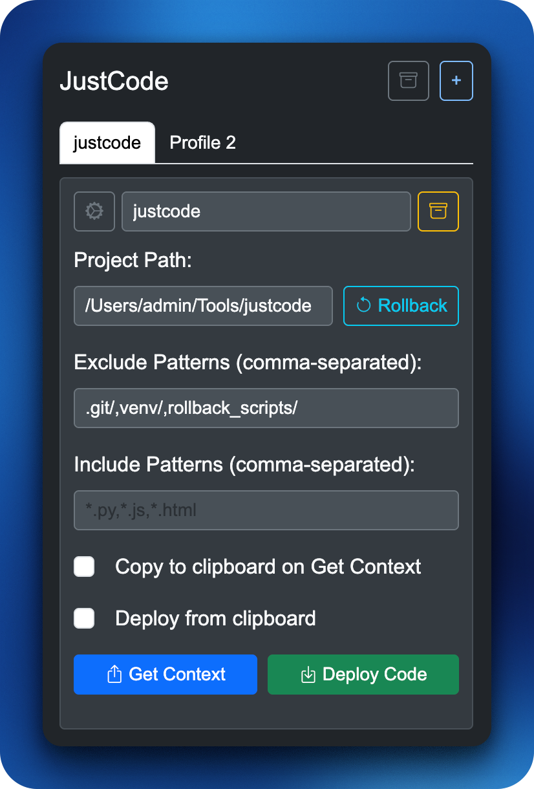

# 🚀 Just Code

Just Code is a rapid development tool that bridges the gap between your local development environment and a Large Language Model (LLM) chat interface. It allows you to:

<p align="center">
  
</p>

1.  **Send your entire project's context** to an LLM with a single click.
2.  **Deploy code generated by the LLM** back to your local files with another single click.

This creates a tight feedback loop, making it incredibly fast to iterate on code with AI assistance.

## ⚙️ How It Works

The system consists of two main components:

*   **🖥️ A Local Flask Server (`app.py`):** This server runs on your machine and acts as the bridge to your filesystem.
    *   `/getcode`: Scans a specified project directory, bundles all relevant source files into a single text block, and formats it as a prompt for the LLM.
    *   `/deploycode`: Receives a shell script from the browser, performs a security validation, and executes it to update your local files.

*   **🧩 Chrome Extension (`chrome_extension/`):** A user-friendly popup interface.
    *   **Popup Interface:** Contains an input for the project path and two buttons: "Get Code" and "Deploy Code".

## ✅ Prerequisites

*   🐍 Python 3.10 or higher
*   📦 `pip` and `venv` (usually included with Python)
*   🐙 Git for cloning the repository
*   🌐 Google Chrome or a Chromium-based browser that supports loading unpacked extensions.

## 🛠️ Setup

The setup process involves three main stages: cloning the code, setting up the local server, and installing the browser extension.

### Stage 1: Clone the Repository

Open your terminal or command prompt and run the following command:

    git clone https://github.com/achendev/justcode.git
    cd justcode

### Stage 2: Set Up and Run the Local Server

Follow the instructions for your operating system to set up the Python environment and run the server.

#### 🍎 macOS & 🐧 Linux (Ubuntu, AlmaLinux, etc.)

1.  **Create and Activate Virtual Environment**
    In the `justcode` directory, run:
    ```bash
    # Create a Python virtual environment
    python3 -m venv venv

    # Activate the environment
    source venv/bin/activate
    ```

2.  **Install Dependencies**
    With the environment active, install the required packages:
    ```bash
    pip install -r requirements.txt
    ```

3.  **Run the Server**
    You can run the server directly with `python app.py`, or use the provided helper script:
    ```bash
    # Make the script executable (only needs to be done once)
    chmod +x app.sh

    # Run the server
    ./app.sh
    ```
    Keep this terminal window open. You should see a message confirming the server is running on `http://127.0.0.1:5010`.


#### 🪟 Windows

1.  **Create and Activate Virtual Environment**
    In the `justcode` directory, open **PowerShell** (recommended) or **Command Prompt (`cmd`)**.

    ```powershell
    # Create a Python virtual environment
    # You may need to use 'py', 'python.exe' or 'python3.exe' if 'python' is not in your PATH
    python -m venv venv

    # Activate the environment in PowerShell
    .\venv\Scripts\Activate.ps1
    ```
    > **Note for PowerShell:** If you get an error about script execution being disabled, run `Set-ExecutionPolicy -ExecutionPolicy RemoteSigned -Scope Process` and try activating again.

    > If using the classic **Command Prompt (`cmd.exe`)**, activate with this command instead:
    > `venv\Scripts\activate.bat`

2.  **Install Dependencies**
    Once the environment is active (your prompt will be prefixed with `(venv)`), run:
    ```bash
    pip install -r requirements.txt
    ```

3.  **Run the Server**
    You can run the server directly with `python app.py`. Alternatively, you can run the provided batch script from your terminal or by double-clicking it in the file explorer.
    ```batch
    app.bat
    ```
    Keep this terminal window open. You should see a message confirming the server is running on `http://127.0.0.1:5010`.

### Stage 3: Load and Configure the Chrome Extension

These steps are the same for all operating systems.

1.  **Load the Extension:**
    *   Open Chrome and navigate to `chrome://extensions/`.
    *   Enable **Developer mode** using the toggle switch (usually in the top-right corner).
    *   Click the **Load unpacked** button.
    *   In the file dialog, select the `chrome_extension` folder located inside your `justcode` project directory.

2.  **Pin the Extension for Easy Access:**
    *   After loading, click the puzzle piece icon 🧩 in the Chrome toolbar to see your list of extensions.
    *   Find the **JustCode Extension** and click the **pin** icon next to it.
    *   This will keep the JustCode icon visible in your toolbar for one-click access.

5.  **Grant Clipboard Permission**

    Just Code requires permission to read from and write to your clipboard. This must be enabled manually in the extension's settings.

    **How to enable:**
    1.  In Chrome, go to **Settings**.
    2.  Navigate to **Extensions** on the left menu.
    3.  Find the **JustCode Extension** and click on the **Details** button.
    4.  On the details page, click on **Site settings**.
    5.  Find **Clipboard** in the permissions list and change its value to **Allow**.

    *This is a critical one-time setup step to allow the extension to read the code provided by the LLM.*

## 🔄 Usage Workflow

1.  **Start the Server:** Ensure the local Flask server is running.
2.  **Open Popup:** Click the JustCode extension icon in your browser toolbar.
3.  **Set Path:** Enter the absolute path to your project.
4.  **Go to LLM:** Navigate to your preferred LLM chat interface.
5.  **Get Code:** Click the `Get Code` button. Your project context will be loaded into the prompt area.
6.  **Prompt LLM:** Add your instructions and submit.
7.  **Get Response:** The LLM will respond with a bash script.
8.  **Deploy Code:** Click the `Deploy Code` button.
9.  **Verify:** Your local files are now updated.

## ⚠️ Security Warning

This tool executes code generated by an LLM directly on your machine. This is **not foolproof**.

*   **ALWAYS review the `bash` script** before clicking "Deploy Code". Malicious commands can delete files.
*   This tool is intended for **personal development and rapid prototyping**.
*   **Use at your own risk.**

## 📂 Project Structure

    justcode/
    ├── app.py              # Flask server for code retrieval/deployment
    ├── app.sh              # Helper script to run server on macOS/Linux
    ├── app.bat             # Helper script to run server on Windows
    ├── chrome_extension/
    │   ├── icons/          # Extension icons (16, 48, 128)
    │   ├── js/             # JavaScript modules
    │   │   ├── background.js   # Handles keyboard shortcuts
    │   │   ├── deploy_code.js  # Logic for deploying code
    │   │   ├── get_code.js     # Logic for getting code context
    │   │   ├── storage.js      # Manages user profiles in storage
    │   │   └── ui.js           # Renders the popup UI
    │   ├── manifest.json   # Extension configuration
    │   ├── popup.html      # Extension popup UI
    │   └── popup.js        # Main entry point for the popup
    ├── .gitignore          # Standard git ignore file
    ├── justcode.png        # Project logo
    ├── requirements.txt    # Python dependencies
    └── README.md           # This file